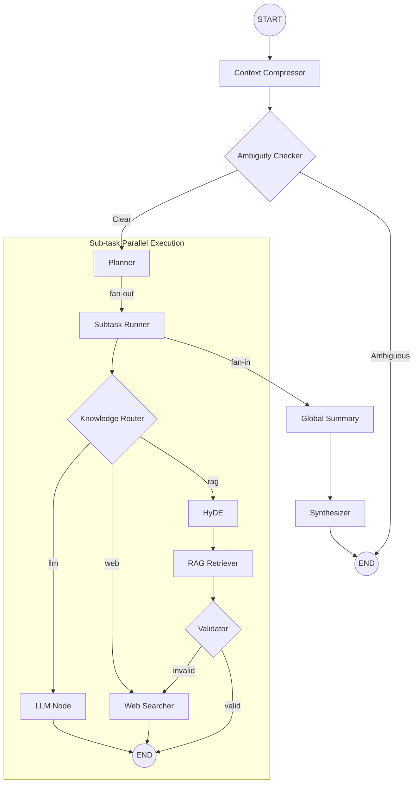

# 🚀 Hierarchical Agentic RAG

[](https://www.python.org/)
[](https://github.com/langchain-ai/langgraph)
[](https://www.llamaindex.ai/)
[](https://fastapi.tiangolo.com/)

**Hierarchical-local** is a state-of-the-art Agentic RAG system that uses a multi-layered workflow to process complex questions across multiple data sources (Internal RAG, Web Search, and LLM Knowledge). Built with **LangGraph** for orchestration and **LlamaIndex** for specialized hierarchical vector storage.

---

## 🏗️ LangGraph Workflow Architecture

The heart of this system is a complex, non-linear graph that handles ambiguity, decomposes questions, and validates retrieval results in parallel.



### Key Workflow Steps:
1.  **Context Compressor**: Distills initial document context into a dense summary.
2.  **Ambiguity Checker**: Determines if the query is clear or needs more information.
3.  **Planner**: Decomposes a single complex question into 1-5 independent sub-tasks.
4.  **Parallel Execution**: Sub-tasks run in parallel, each with its own retrieval logic:
    *   **Knowledge Router**: Chooses the best source (RAG, Web, or LLM).
    *   **HyDE**: Generates hypothetical documents to boost retrieval accuracy.
    *   **Validator**: Checks if the retrieved context actually covers the task.
5.  **Fan-in & Synthesis**: All findings are summarized and synthesized into a final, coherent answer.

---

## ✨ Features

-   **Hierarchical RAG**: Uses LlamaIndex's `AutoMergingRetriever` to store small chunks but retrieve parent context for better relevance.
-   **Parallel Agency**: Leverages LangGraph's `Send` API to execute multiple retrieval tasks simultaneously.
-   **Provider Agnostic**: Supports **Google Gemini** (Vertex/API) and **Ollama** (Local models) out of the box.
-   **Web Search Integration**: Automatically falls back to Tavily Web Search if internal knowledge is insufficient.
-   **FastAPI Backend**: Fully asynchronous API with endpoints for ingestion, chat, and database management.

---

## 🚀 Getting Started

You can run this project in two ways: locally after cloning the repository, or using the pre-built Docker image.

### Option 1: Local Development (via GitHub)

Use this method if you want to modify the code or contribute.

#### 1. Clone & Install
```bash
git clone https://github.com/hoangkhang226/Hierachical-local.git
cd Hierachical-local
python -m venv venv
source venv/bin/activate  # or venv\Scripts\activate on Windows
pip install -r requirements.txt
```

#### 2. Environment Variables
Create a `.env` file in the root directory:
```env
GOOGLE_API_KEY=your_key
TAVILY_API_KEY=your_key
LANGSMITH_API_KEY=your_key
```

#### 3. Run the API
```bash
python main.py
```

---

### Option 2: Docker Quick Start (via Docker Hub)

Use this method to run the production-ready image without setting up a Python environment.

#### 1. Pull the Image
```bash
docker pull hoangkhang226/hierachical-rag:latest
```

#### 2. Run the Container
Replace `YOUR_API_KEYS` with your actual keys or use your local `.env` file:
```bash
docker run -d \
  -p 8000:8000 \
  -e GOOGLE_API_KEY=your_key \
  -e TAVILY_API_KEY=your_key \
  -v $(pwd)/storage:/app/storage \
  -v $(pwd)/logs:/app/logs \
  --name hierachical-rag \
  hoangkhang226/hierachical-rag:latest
```

---

## 🐳 Developer: Building & Publishing Docker

If you want to build and publish your own version:

### 1. Build locally
```bash
docker build -t hierachical-rag .
```

### 2. Tag and Push
```bash
docker tag hierachical-rag:latest hoangkhang226/hierachical-rag:latest
docker push hoangkhang226/hierachical-rag:latest
```

---

## 🔌 API Endpoints

-   `GET /health`: Check system status.
-   `POST /ingest`: Upload a PDF to the hierarchical index.
-   `POST /chat`: Interact with the agentic RAG pipeline.
-   `DELETE /reset`: Wipe the database for a specific provider.

---

## 📦 Project Structure

```text
├── config/             # YAML settings and logging config
├── src/                # Root source directory
│   ├── agents/         # LangGraph logic (node, graph, state, tool)
│   ├── core/           # Config loading and orchestrators
│   ├── llm/            # LLM factory and provider clients
│   ├── processors/     # PDF extraction and hierarchical chunking
│   ├── retrieval/      # Vector DB management (Chroma + LlamaIndex)
│   └── utils/          # Custom logging and helpers
├── storage/            # Local vector database persistence
├── main.py             # FastAPI entry point
└── requirements.txt    # Project dependencies
```
#
