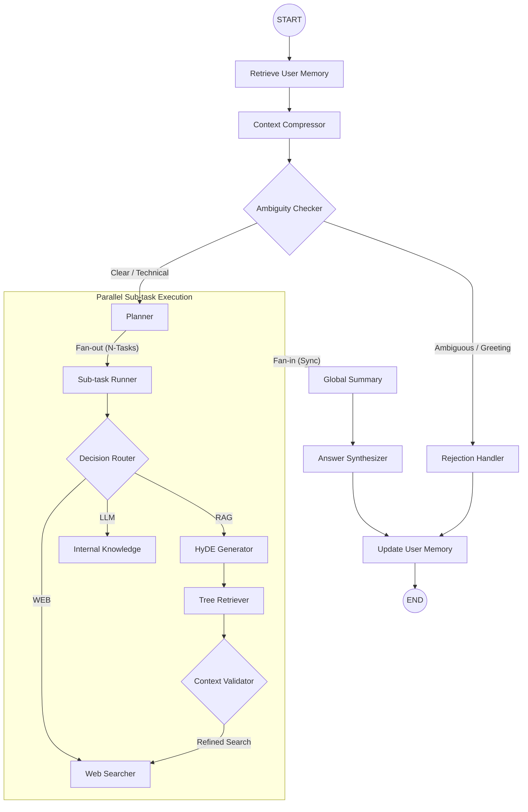

# 🚀 Hierarchical Agentic RAG

[](https://www.python.org/)
[](https://github.com/langchain-ai/langgraph)
[](https://mem0.ai/)
[](https://www.llamaindex.ai/)

**Hierarchical-local** is a state-of-the-art Agentic RAG system that uses a multi-layered workflow to process complex questions across multiple data sources. It features persistent long-term memory, parallel execution, and hybrid cloud/local model support.

---

## 🏗️ State-of-the-Art Workflow

The system uses **LangGraph** to orchestrate a non-linear, resilient pipeline that handles everything from casual greetings to complex technical queries across thousands of document chunks.



### ✨ Why Mem0?

Traditional RAG systems suffer from "contextual amnesia"—they forget who you are as soon as the session ends. This project integrates **Mem0** to extract and store **Atomic Facts** from your conversations.

> "The Agent remembers your identity, preferences, and project goals across sessions, allowing for a truly personalized and 'human' interaction vibe."

---

## 🛠️ Dual-Mode Configuration

This project is built for flexibility, supporting everything from high-performance cloud models to privacy-focused local execution.

| Deployment Mode          | LLM Provider        | Embedding Provider (Memory) | Use Case                                          |
| :----------------------- | :------------------ | :-------------------------- | :------------------------------------------------ |
| **Full Cloud**           | Google Gemini 2.5   | Google Gemini               | Maximum speed and reasoning power.                |
| **Local Privacy**        | Ollama (Qwen/Llama) | Ollama (Nomic)              | 100% private, no external API calls for data.     |
| **Hybrid (Recommended)** | Google Gemini       | Ollama (Local)              | Fast reasoning with local private memory storage. |

---

## 🔍 Observability with LangSmith

Debugging complex agentic chains is difficult. This project includes first-class integration with **LangSmith**. You can trace every node execution, visualize the graph state in real-time, and audit exactly why the system chose a specific retrieval path.

---

## ✨ Features

- **Hierarchical RAG**: Uses LlamaIndex's `AutoMergingRetriever` to store small chunks but retrieve parent context for superior relevance.
- **Parallel Agency**: Leverages LangGraph's `Send` API to execute multiple sub-tasks simultaneously, cutting response times for multi-part questions.
- **Ambiguity Shield**: A intelligent "Ambiguity Checker" that prioritizes user memory and social context before deciding to reject or process a query.
- **Smart Routing**: Dynamically chooses between RAG, Tavily Web Search, or LLM internal knowledge based on the query's domain.

---

---

## 🚀 Getting Started

You can run this project in two ways: locally after cloning the repository, or using the pre-built Docker image.

### Option 1: Local Development (via GitHub)

Use this method if you want to modify the code or contribute.

#### 1. Clone & Install
```bash
git clone https://github.com/hoangkhang226/Hierachical-local.git
cd Hierachical-local
python -m venv venv
source venv/bin/activate  # or venv\Scripts\activate on Windows
pip install -r requirements.txt
```

#### 2. Configure Environment
Create a `.env` file in the root directory:
```env
GOOGLE_API_KEY=your_key
TAVILY_API_KEY=your_key
LANGSMITH_API_KEY=your_key
```

#### 3. Run the API
```bash
python main.py
```

---

### Option 2: Docker Quick Start (via Docker Hub)

Use this method to run the production-ready image without setting up a Python environment.

#### 1. Pull the Image
```bash
docker pull hoangkhang226/hierachical-rag:latest
```

#### 2. Run the Container
Replace your API keys or use your local `.env` file:
```bash
docker run -d \
  -p 8000:8000 \
  --env-file .env \
  -v $(pwd)/storage:/app/storage \
  -v $(pwd)/logs:/app/logs \
  --name hierachical-rag \
  hoangkhang226/hierachical-rag:latest
```

---

## 🐳 Developer: Building & Publishing Docker

If you want to build and publish your own version:

### 1. Build locally
```bash
docker build -t hierachical-rag .
```

### 2. Tag and Push
```bash
docker tag hierachical-rag:latest hoangkhang226/hierachical-rag:latest
docker push hoangkhang226/hierachical-rag:latest
```

---

## ⚠️ Note on Performance

Because the system uses **Local Ollama** for Memory and Fact Extraction by default to preserve privacy, the "START" and "END" of a conversation turn may incur **3-5 seconds of latency**. This is the time required for the local model to embed text and update the vector database.

---

## 🔌 API Endpoints

-   `POST /ingest`: Upload PDF to the hierarchical index.
-   `POST /chat`: Interact with the Agentic RAG pipeline.
-   `GET /health`: Check system and model status.

---

## 📦 Project Structure

```text
├── config/             # YAML settings and logging config
├── src/                # Root source directory
│   ├── agents/         # LangGraph logic (nodes, graph, state, tool)
│   ├── core/           # Config loading and orchestrators
│   ├── llm/            # LLM factory and provider clients
│   ├── processors/     # PDF extraction and hierarchical chunking
│   ├── retrieval/      # Vector DB management (Chroma + LlamaIndex)
│   └── utils/          # Custom logging and helpers
├── storage/            # Local vector database persistence
├── main.py             # FastAPI entry point
└── requirements.txt    # Project dependencies
```
